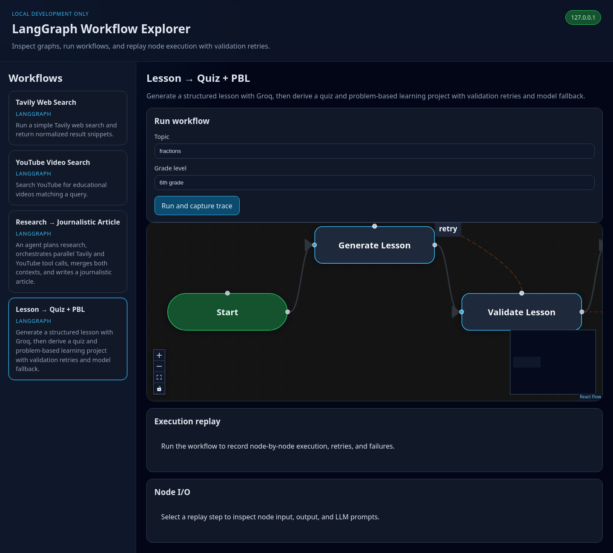
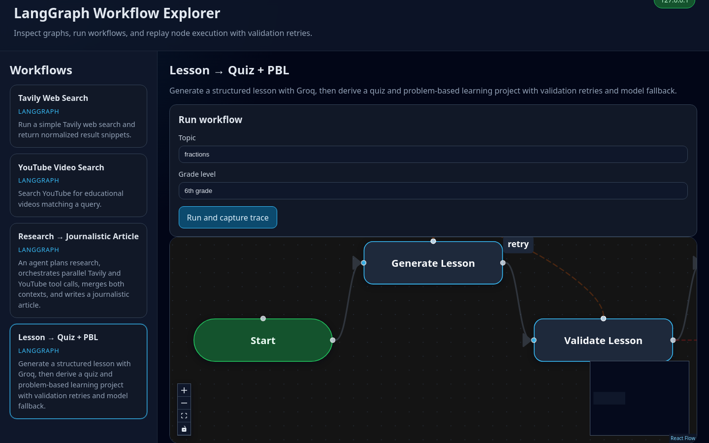
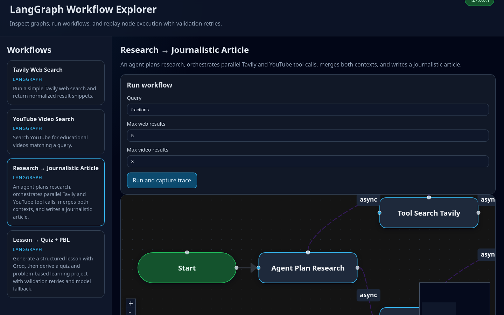
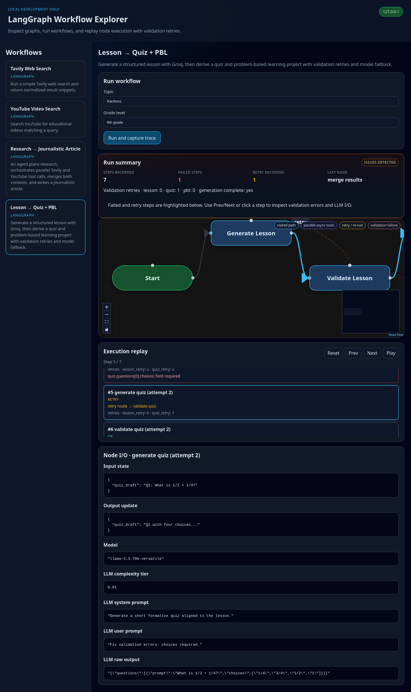
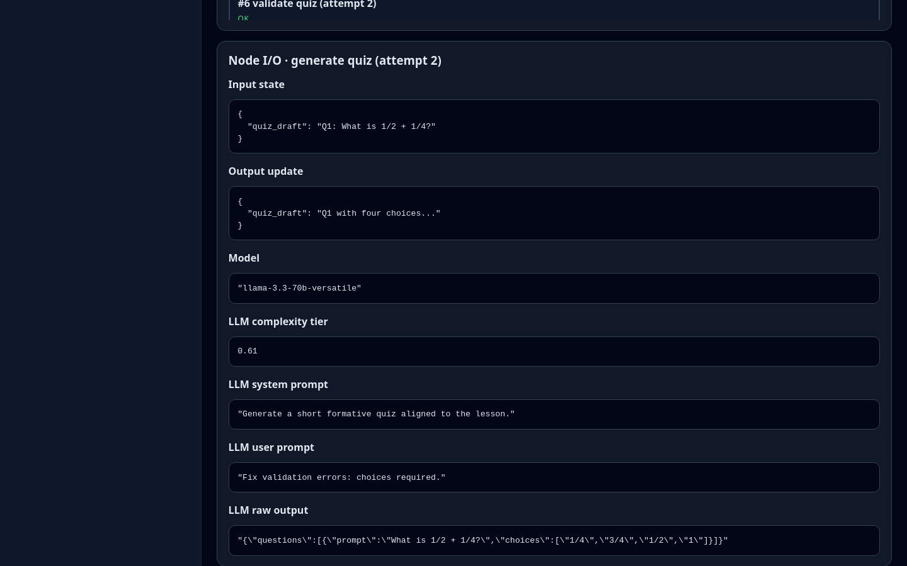

# ed-tech-system-mcp

Domain-Driven MCP (Model Context Protocol) server for ed-tech workflows. The server exposes validated MCP tools backed by LangGraph agents, Supabase document retrieval, web search, and YouTube video discovery — all organized with Clean Architecture and DDD.



## What this project does

External MCP clients call **MCP tools** that validate input with Pydantic, delegate to **application workflows** and **LangGraph agents**, and reach external systems through **domain ports** implemented in the infrastructure layer.

### MCP tools

| Tool | Module | Purpose |
| :--- | :--- | :--- |
| `health_check` | `custom_tools` | Liveness probe |
| `find_documents` | `custom_tools` | Document retrieval enriched with related videos |
| `search_youtube` | `custom_tools` | Educational YouTube search |
| `run_workflow` | `custom_tools_workflow` | Document + video discovery LangGraph workflow |
| `research_article` | `custom_tools_agent_workflows` | Research article generation workflow |
| `content_generation` | `custom_tools_agent_workflows` | Lesson/quiz/project content generation |
| `author_lesson_pipeline` | `custom_tools_authoring` | Graph leaf → generate → validate → save (draft/publish) |
| `search_graph_nodes` | `custom_tools_authoring` | Curriculum graph leaf search |
| `validate_lesson` / `validate_quiz` / `validate_project` / `validate_test_boilerplate` | `custom_tools_authoring` | Content validation |
| `save_to_backend` | `custom_tools_authoring` | Persist authored lesson tree via backend RPCs |
| `generate_mock_test_structure` / `validate_mock_test` | `custom_tools_authoring` | Mock assessment scaffolding |
| `socratic_tutor` | `custom_tools_socratic` | Socratic tutor turn |
| `collect_project_review_context` / `project_review` | `custom_tools_project_review` | Project mentor review |

Handlers use **MCP tool caching** (when enabled), **latency logging**, **privileged auth** where required, and **domain error mapping** at the protocol boundary.

### Integrations

| Capability | Integration |
| :--- | :--- |
| Document / vector retrieval | Supabase (Postgres / pgvector) and optional Chroma |
| Curriculum graph + authoring RPCs | Supabase RPCs via authoring backend client (anon + manager JWT) |
| Web search | DuckDuckGo / Tavily |
| Video discovery | YouTube Data API v3 |
| Agent orchestration | LangChain / LangGraph |
| Caching | Redis when `CACHE_ENABLED=true` |
| Local workflow UI | FastAPI + React (`ui/`) |

## Architecture

Clean Architecture under `src/mcp_server/`. **Dependency rule:** Domain has no framework I/O; Infrastructure implements Domain ports; Interface and Application depend inward only.

```text
entrypoint → interface → application → domain ← infrastructure
```

| Layer | Path | Responsibility |
| :--- | :--- | :--- |
| **domain** | `domain/` | Entities, ports, validators, curriculum enums — no MCP/LangGraph/Supabase |
| **application** | `application/` | LangGraph `agents/`, runners, LLM routing, authoring services |
| **interface** | `interface/` | MCP tools (`custom_tools*.py`), validation, error mapping, local UI API |
| **infrastructure** | `infrastructure/` | Supabase, search, YouTube, Groq, Redis, retrieval/embeddings/rerank |
| **entrypoint** | `main.py`, `wiring.py`, `settings.py`, … | Bootstrap and composition root only |

**Changelog folders** use the same names plus `tests`, `performance`, `code-health`, `refactor` — see [ARCHITECTURE.md § Changelog layer names](./ARCHITECTURE.md#changelog-layer-names).

**Read next:** [ARCHITECTURE.md](./ARCHITECTURE.md) (layer rules, tree, anti-patterns) · [AGENTIC_ARCHITECTURE.md](./AGENTIC_ARCHITECTURE.md) (graphs / tools) · [OBSERVABILITY.md](./OBSERVABILITY.md) (workflow UI / traces).

## Quick start

### Prerequisites

- Python **3.12** (see `requires-python` in `pyproject.toml`)
- [uv](https://docs.astral.sh/uv/) — environment and dependency manager
- [Doppler CLI](https://docs.doppler.com/docs/cli) (recommended for secrets) or a local gitignored `.env`

### Install

```bash
uv python install 3.12
uv sync --all-groups
```

### Configure secrets

Secrets never enter git. Use Doppler (team) or a local `.env` (solo dev).

```bash
doppler login
./scripts/doppler/setup-local.sh
./scripts/doppler/bootstrap-from-env-example.sh   # first time only — uploads placeholders
# Fill real values in the Doppler dashboard → ed-harness-system
```

Required variables: `APP_ENV`, `SUPABASE_URL`, `SUPABASE_SERVICE_ROLE_KEY`, `YOUTUBE_API_KEY`.

Optional: `GROQ_API_KEY` (only when an LLM path is invoked — lazy-init at first use), `TAVILY_API_KEY`, `LOG_LEVEL` (applied at bootstrap via `configure_logging()`). Staging/production also require `CACHE_ENABLED=true` and `REDIS_URL` (local/CI keep the default off).

See [ENVIRONMENT_SETUP.md](./ENVIRONMENT_SETUP.md) for the full secrets workflow.

### Run the MCP server

```bash
# With Doppler
doppler run -- uv run mcp-server

# With local .env (APP_ENV=development)
uv run mcp-server
```

### Run the workflow UI (optional)

Local dev UI for inspecting workflow graphs, running test executions, and replaying traces:

```bash
./scripts/dev/run-workflow-ui.sh
```

API: `http://127.0.0.1:8877` (default) · React dev server: `http://127.0.0.1:4173`

| View | What it shows |
| :--- | :--- |
| **Workflow explorer** | Sidebar of registered LangGraph workflows with run forms |
| **Graph canvas** | Compiled nodes, forward/retry/failure edges, live replay highlighting |
| **Execution replay** | Step-by-step trace with validation errors and retry decisions |
| **Node I/O inspector** | Per-step state snapshots, LLM prompts, and raw model output |

**Graph visualization** — retry loops and parallel branches are rendered on the canvas:

| Content generation (validation retries) | Research article (parallel tool calls) |
| :---: | :---: |
|  |  |

**Trace replay & debugging** — after a run, scrub through each node, inspect failures, and read LLM I/O:



**Node I/O inspector** — per-step state snapshots, validation errors, and LLM prompts/raw output:



See [OBSERVABILITY.md](./OBSERVABILITY.md) for graph replay, node I/O inspection, and trace API details.

To refresh README screenshots after UI changes:

```bash
./scripts/dev/run-workflow-ui.sh   # in one terminal
npx -p playwright node scripts/dev/capture-ui-screenshots.mjs   # in another
```

## Development

### Day-to-day commands

```bash
uv sync --frozen              # after pulling lockfile changes
uv run mcp-server             # start server
uv run ruff check src/        # lint
uv run ruff format --check src/
uv run mypy src/              # type check
uv run pytest                 # tests (143 cases as of 2026-07-21)
```

### Engineering backlog

Audit findings are triaged into [`backlog/BACKLOG.md`](./backlog/BACKLOG.md) (RICE-ranked, traceable to changelog audits). As of 2026-07-21: **23 done**, **6 deferred** (adapter HTTP implementation, profiling, trace IDs).

### Add dependencies

```bash
uv add some-package           # runtime
uv add --group dev some-tool  # dev only
```

Do not use `pip install` in this repo — it bypasses the lockfile.

### Quality gates (CI parity)

```bash
uv sync --frozen --all-groups
uv run ruff check src/
uv run mypy src/
npm run lint:architecture   # layer imports + boundary patterns (also runs on git push)
uv run pytest
```

**Git hooks:** Husky **pre-commit** runs public-repo safety checks (sensitive files, tracked leaks, secret scanners); **pre-push** re-checks tracked safety, scans pushed commits for secret content, then runs architecture lint — neither blocks the other tier.

Run quality-gate commands from the **repository root** (`ed-tech-system-mcp/`), not `ui/`. The same scripts are also available inside `ui/` via `npm run hooks:test` and `npm run lint:architecture`.

## Project layout

```text
.
├── src/mcp_server/
│   ├── domain/              # Entities, ports, validators, enums
│   ├── application/         # Agents, runners, LLM routing, authoring services
│   │   └── agents/          # LangGraph packages (content_generation, socratic, …)
│   ├── interface/           # MCP tools + local_ui API
│   ├── infrastructure/      # Adapters (retrieval, embeddings, cache, clients)
│   ├── wiring.py            # Composition root
│   ├── settings.py
│   └── main.py              # mcp-server entry
├── tests/                   # pytest + architecture lint
├── changelog/               # Agent memory: {DATE}/{LAYER}/ (local)
├── ui/                      # React workflow graph UI
├── scripts/                 # Doppler, hooks, Render, dev UI
├── docs/assets/             # README screenshots
├── ARCHITECTURE.md          # Layer boundaries (canonical)
├── AGENTIC_ARCHITECTURE.md  # Agent graphs and tool orchestration
├── OBSERVABILITY.md         # Workflow UI, trace replay
└── ENVIRONMENT_SETUP.md     # uv, secrets, CI, MCP client config
```

## Documentation index

See the [documentation matrix](#documentation-matrix) at the end of this file for canonical docs and changelog artifacts.

## MCP client integration

Register the server in your MCP host using the project interpreter:

```json
{
  "mcpServers": {
    "ed-tech-system": {
      "command": "doppler",
      "args": ["run", "--", "uv", "--directory", "/absolute/path/to/ed-tech-system-mcp", "run", "mcp-server"]
    }
  }
}
```

Alternative patterns (local `.env`, `uv` launcher) are in [ENVIRONMENT_SETUP.md § MCP client integration](./ENVIRONMENT_SETUP.md#mcp-client-integration).

## Documentation matrix

Read the **minimum** doc set for your task. Do not load everything.

### Canonical docs (repo root)

| Document | Read when |
| :--- | :--- |
| [README.md](./README.md) | First visit — overview, quick start, MCP tools, workflow UI |
| [ARCHITECTURE.md](./ARCHITECTURE.md) | Any code change — layers, ports/adapters, deps per layer, file layout, anti-patterns |
| [AGENTIC_ARCHITECTURE.md](./AGENTIC_ARCHITECTURE.md) | LangGraph/LangChain agents, LLM wiring, tool taxonomy, DB/web/video flows |
| [OBSERVABILITY.md](./OBSERVABILITY.md) | Local workflow UI, execution replay, trace/API debugging |
| [ENVIRONMENT_SETUP.md](./ENVIRONMENT_SETUP.md) | `uv`, lockfile, deps, env vars, `ruff`/`mypy`/`pytest`, CI, MCP client setup |

**Conflict resolution:** `ARCHITECTURE.md` wins on layer boundaries; `AGENTIC_ARCHITECTURE.md` wins on orchestration semantics.

### Engineering backlog

| Document | Read when |
| :--- | :--- |
| [backlog/BACKLOG.md](./backlog/BACKLOG.md) | RICE-ranked tasks from audits; status tracking |
| [backlog/RICE.md](./backlog/RICE.md) | Scoring rubric and priority formula for backlog items |

### Changelog memory (`changelog/{DATE}/{LAYER}/`)

Local engineering memory (often gitignored). `{LAYER}` must match an architecture layer or audit folder:

`domain` · `application` · `interface` · `infrastructure` · `entrypoint` · `tests` · `performance` · `code-health` · `refactor`

| File pattern | Purpose |
| :--- | :--- |
| `INVESTIGATION{N}.md` | Scope and gaps before coding |
| `IMPLEMENTATION{N}.md` | Execution checklist and status |
| `CODE_REVIEW{N}.md` | Pre-merge review findings |
| `TEST{N}.md` | Behavior catalog before writing tests |
| `HOMOLOGATION.md` | Coverage verdict after tests pass |
| `PERFORMANCE_AUDIT{N}.md` | Performance bottleneck findings |
| `CODE_HEALTH_AUDIT{N}.md` | Maintainability / dead-code findings |
| `REFACTOR{N}.md` | Merged refactor actions from audits |
| `LOOP_BREAK{N}.md` | Recursive-loop parameters and iteration log |

**Pairing:** `IMPLEMENTATION{N}` ↔ `INVESTIGATION{N}`; `CODE_REVIEW{N}` ↔ same `{N}`. Full protocol: `.cursor/rules/changelog-agent-memory.mdc`.

### Quick routing

```text
Code in a layer?        → ARCHITECTURE.md (+ AGENTIC_ARCHITECTURE.md if agents/tools/LLM)
Workflow UI / traces?   → OBSERVABILITY.md
Environment / CI?       → ENVIRONMENT_SETUP.md
Secrets / Doppler?      → ENVIRONMENT_SETUP.md § Secrets & safety
Tests / merge gate?     → pytest + quality gates in ENVIRONMENT_SETUP.md
Audits / cleanup?       → backlog/BACKLOG.md
```

## License

[MIT](LICENSE)
